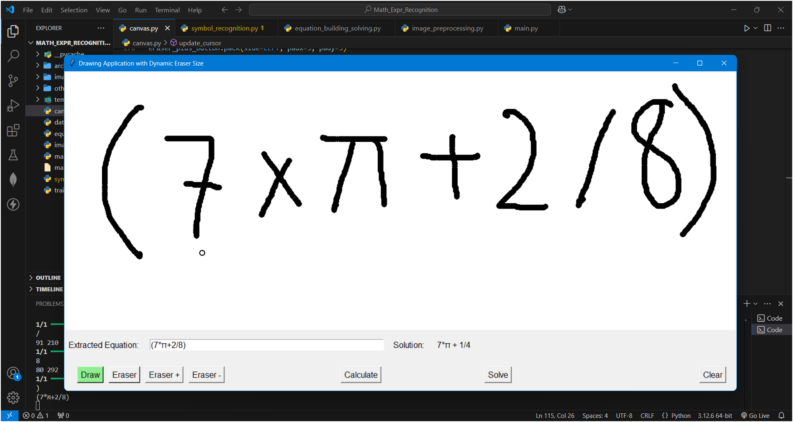
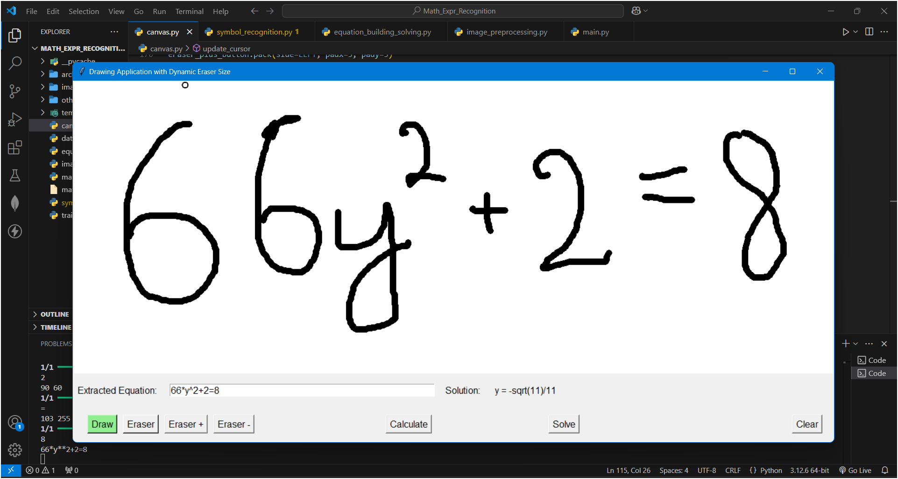
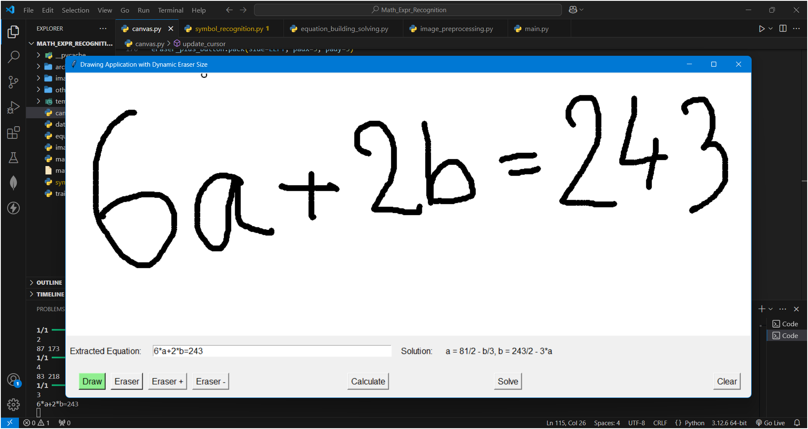

# Mathematical Expression Recognizer and Solver

## Overview
This academic project, developed in collaboration with a group, focuses on recognizing and solving handwritten mathematical expressions. Using **Convolutional Neural Networks (CNNs)** and **TensorFlow**, we built a symbol recognition model that processes input expressions written on a canvas.

-> Supported symbols: (, ), 0, 1, 2, 3, 4, 5, 6, 7, 8, 9, =, π, a, b, c, y

## Approach
1. **Image Processing**: We applied preprocessing techniques like grayscale conversion, noise reduction, and thresholding to enhance image clarity.
2. **Symbol Recognition**: A CNN-based model was trained using TensorFlow to recognize mathematical symbols (digits, operators, etc.) from images.
3. **Expression Solver**: After recognizing the symbols, we used symbolic computation to solve the mathematical expression.

This project showcases the use of machine learning and image processing to automate the solving of handwritten math problems.

# Overview

